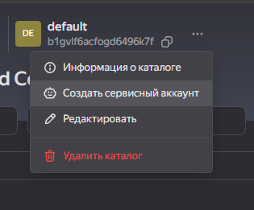
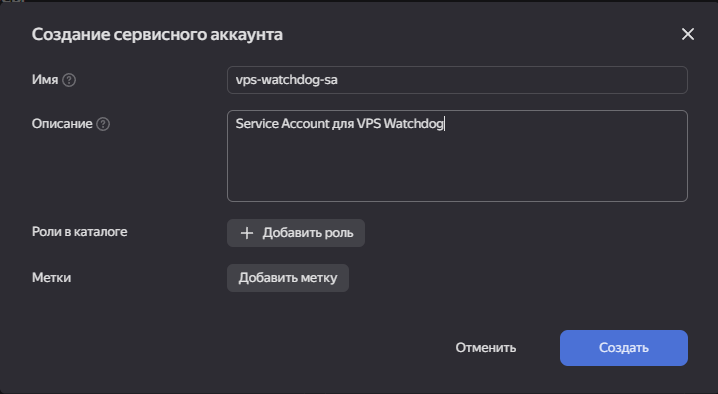
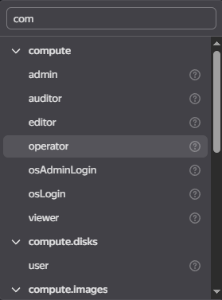
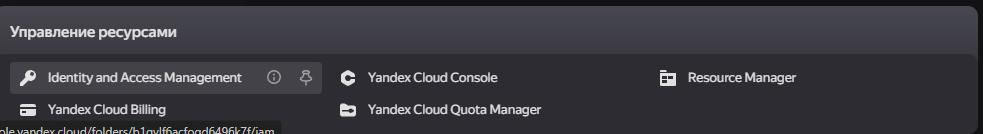
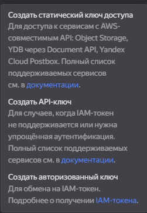
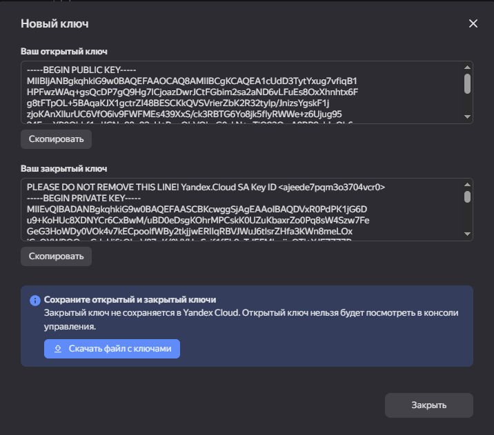

# 🛡️ VPS Watchdog v3.0

**Автоматический мониторинг и перезапуск виртуальных машин в Yandex Cloud**

[](https://opensource.org/licenses/MIT)
[](https://www.python.org/downloads/)
[](https://cloud.yandex.ru/)

---

## 📖 Описание

VPS Watchdog — это система автоматического мониторинга виртуальных машин в Yandex Cloud. Если ваша VM перестаёт отвечать на ping, VPS Watchdog автоматически запускает её через API Yandex Cloud и отправляет уведомления в Telegram.

### ✨ Возможности

- 🔍 **Мониторинг** множества VM одновременно
- 🚀 **Автоматический запуск** остановленных VM
- 📱 **Telegram уведомления** о событиях
- ⚙️ **Гибкая настройка** интервалов проверки
- 🔄 **Cooldown периоды** для избежания частых перезапусков
- 📊 **Подробная статистика** работы
- 🎯 **Простое управление** через интерактивное меню
- 🔐 **Service Account** авторизация

---

## 🎬 Демонстрация работы

### 📊 Успешный мониторинг и автозапуск VM

```
[EyTest] ✅ VM доступна
[EyTest] ❌ VM не отвечает (попытка 1)
[EyTest] Текущий статус: STOPPED
[EyTest] Запуск VM...
[EyTest] 🚀 Операция запуска: epdr2rfb5u1ipgll4q0h
[EyTest] ✅ VM восстановлена (downtime: 45с)
```

### 🎯 Интерактивное меню управления

```
🛡️  VPS WATCHDOG v3.0.2-SA
━━━━━━━━━━━━━━━━━━━━━━━━━━━━━━━━━━━━━━━━━━━━━━━
📊 СТАТУС:
   📝 Профилей: 1 (активных: 1)
   ⚙️  Сервис: работает
   📱 Telegram: настроен
   🔑 SA ключ: настроен

📋 УПРАВЛЕНИЕ ПРОФИЛЯМИ:
  1) 📝 Список профилей
  2) ➕ Добавить профиль
  3) ✏️  Редактировать профиль
  ...
```

---

## 🚀 Быстрый старт

### Требования

- Ubuntu 20.04+ / Debian 11+
- Docker и Docker Compose
- Service Account в Yandex Cloud с ролью `compute.admin`

### Установка за 3 минуты

```bash
# 1. Скачай и установи
curl -fsSL https://raw.githubusercontent.com/Mastachok/ya-vps-autostart/main/install.sh | bash

# 2. Запусти меню (автоматически откроется мастер настройки)
vps-watchdog

# 3. Следуй инструкциям мастера:
#    → Добавь Service Account ключ
#    → Создай профиль VM
#    → Готово!

# 4. Проверь работу
docker logs -f vps-watchdog
```

---

## 📋 Пошаговая инструкция

### Шаг 1: Создание Service Account


*Открой каталог в Yandex Cloud Console → Создать сервисный аккаунт*


*Имя: `vps-watchdog-sa`, Описание: `Service Account для VPS Watchdog`*


*Добавь роль: `compute.operator` (для управления VM)*


*Доступ через Identity and Access Management*


*Создать авторизованный ключ для обмена на IAM-токен*


*Скачай JSON файл с ключами — он понадобится при настройке*

### Шаг 2: Установка на VM

```bash
# Подключись к VM мониторинга
ssh root@your-monitoring-vm-ip

# Установи VPS Watchdog
curl -fsSL https://raw.githubusercontent.com/Mastachok/ya-vps-autostart/main/install.sh | bash

# Запустится автоматически после установки
```

### Шаг 3: Первоначальная настройка (Мастер)

При первом запуске `vps-watchdog` автоматически запустится мастер:

```
═══════════════════════════════════════════════════════════════
          🎯 МАСТЕР ПЕРВОНАЧАЛЬНОЙ НАСТРОЙКИ
═══════════════════════════════════════════════════════════════

⚠️  Первый запуск! Настроим VPS Watchdog за 3 шага:

  1️⃣  Добавим Service Account ключ
  2️⃣  Создадим профиль VM для мониторинга
  3️⃣  Запустим мониторинг

Начать настройку? (y/n):
```

**ШАГ 1:** Откроется nano для вставки SA ключа
- Открой скачанный `key.json`
- Скопируй всё содержимое (Ctrl+A, Ctrl+C)
- Вставь в nano (правая кнопка мыши)
- Сохрани: Ctrl+O → Enter → Ctrl+X

**ШАГ 2:** Введи данные VM для мониторинга
```
Имя VM: my-production-vm
IP адрес: 51.250.27.80
Instance ID: epdfv5c8r930gcm4flqj
Folder ID: b1gv1f6acfogd6496k7f
```

**ШАГ 3:** Мониторинг запустится автоматически!

### Шаг 4: Настройка Telegram (опционально)

Подробная инструкция: [TELEGRAM-SETUP.md](TELEGRAM-SETUP.md)

Кратко:
1. Создай бота через @BotFather
2. Получи токен и chat ID
3. В меню `vps-watchdog` → пункт 6
4. Введи данные бота
5. Проверь тестовым уведомлением (пункт 7)

---

## 📚 Где взять данные для настройки

### Instance ID

```bash
# В Yandex Cloud Console
Compute Cloud → Виртуальные машины → Выбери VM → 
ID виртуальной машины (вверху страницы)

# Или через CLI
yc compute instance list
```

### Folder ID

```bash
# В Yandex Cloud Console  
Нажми на название каталога вверху → Скопируй ID

# Или через CLI
yc config list
```

### IP адрес VM

```bash
# В Yandex Cloud Console
Compute Cloud → Виртуальные машины → Столбец "IP-адрес"

# Или на самой VM
hostname -I | awk '{print $1}'
```

---

## ⚙️ Конфигурация

### Структура файлов

```
/opt/vps-watchdog/
├── app/
│   ├── monitor.py          # Основной скрипт мониторинга
│   ├── telegram_bot.py     # Telegram интеграция
│   ├── vm_manager.py       # Управление профилями
│   └── Dockerfile          # Docker образ
├── bin/
│   └── vps-watchdog        # CLI меню
├── config/
│   ├── sa-key.json         # Service Account ключ
│   └── telegram.json       # Настройки Telegram
├── profiles/
│   └── *.json              # Профили VM
├── data/
│   └── watchdog.db         # База данных статистики
└── docker-compose.yml      # Docker Compose конфигурация
```

### Параметры профиля VM

```json
{
  "id": "abc123",
  "name": "my-vm",
  "vm_host": "51.250.27.80",
  "instance_id": "epdfv5c8r930gcm4flqj",
  "folder_id": "b1gv1f6acfogd6496k7f",
  "enabled": true,
  "check_interval": 60,          // Интервал проверки (секунды)
  "ping_count": 3,               // Количество ping запросов
  "ping_timeout": 5,             // Таймаут ping (секунды)
  "cooldown_minutes": 5,         // Пауза после запуска (минуты)
  "max_start_attempts": 3        // Макс попыток запуска подряд
}
```

---

## 🔧 Управление

### Команды CLI

```bash
# Открыть меню управления
vps-watchdog

# Управление сервисом
systemctl status vps-watchdog
systemctl start vps-watchdog
systemctl stop vps-watchdog
systemctl restart vps-watchdog

# Логи мониторинга
docker logs -f vps-watchdog

# Логи Docker Compose
journalctl -u vps-watchdog -f

# Перезапуск Docker контейнера
cd /opt/vps-watchdog
docker-compose restart
```

### Пункты меню

```
📋 УПРАВЛЕНИЕ ПРОФИЛЯМИ:
  1) Список профилей      - Показать все VM
  2) Добавить профиль     - Добавить новую VM для мониторинга
  3) Редактировать        - Изменить параметры профиля
  4) Удалить профиль      - Удалить VM из мониторинга
  5) Включить/выключить   - Временно отключить мониторинг VM

📱 TELEGRAM:
  6) Настроить бота       - Добавить Telegram бота
  7) Тест уведомления     - Проверить работу бота
  8) Статус бота          - Информация о боте

⚙️ СИСТЕМА:
  9) Управление сервисом  - Start/Stop/Restart
  10) Показать логи       - Просмотр логов мониторинга
  11) Статистика          - Статистика по всем VM

🔐 SERVICE ACCOUNT:
  13) Загрузить SA ключ   - Добавить/обновить SA ключ
  14) Проверить SA ключ   - Проверить валидность ключа
```

---

## 🔍 Мониторинг и отладка

### Проверка работы

```bash
# Статус контейнера
docker ps | grep watchdog

# Логи в реальном времени
docker logs -f vps-watchdog

# Последние 50 строк логов
docker logs vps-watchdog --tail 50

# Логи systemd сервиса
journalctl -u vps-watchdog --since "10 minutes ago"
```

### Типичные сообщения в логах

**✅ Всё работает:**
```
[my-vm] SDK инициализирован
[my-vm] Запуск мониторинга
[my-vm] ✅ VM доступна
```

**⚠️ VM упала, запускается:**
```
[my-vm] ❌ VM не отвечает (попытка 1)
[my-vm] Текущий статус: STOPPED
[my-vm] Запуск VM...
[my-vm] 🚀 Операция запуска: operation-id
```

**✅ VM восстановлена:**
```
[my-vm] ✅ VM восстановлена (downtime: 45с)
```

**❌ Ошибка SA ключа:**
```
❌ SA ключ не найден: /app/config/sa-key.json
```

---

## 🐛 Устранение проблем

### VM не запускается

**Проблема:** Логи показывают "Ошибка запуска"

**Решения:**
1. Проверь права SA:
   ```bash
   # SA должен иметь роль compute.operator
   ```

2. Проверь квоты в Yandex Cloud:
   ```
   Зайди в Cloud Console → Квоты
   Убедись что есть доступные ресурсы
   ```

3. Проверь статус VM вручную:
   ```bash
   yc compute instance get <instance-id>
   ```

### SA ключ не работает

**Проблема:** "SDK не инициализирован"

**Решения:**
1. Проверь JSON:
   ```bash
   cat /opt/vps-watchdog/config/sa-key.json | python3 -m json.tool
   ```

2. Проверь права:
   ```bash
   ls -la /opt/vps-watchdog/config/sa-key.json
   # Должно быть: -rw------- (600)
   chmod 600 /opt/vps-watchdog/config/sa-key.json
   ```

3. Пересоздай ключ в Yandex Cloud

### Telegram не работает

**Проблема:** Уведомления не приходят

**Решения:**
1. Проверь конфиг:
   ```bash
   cat /opt/vps-watchdog/config/telegram.json
   ```

2. Проверь токен и chat_id:
   ```bash
   # Тестовый запрос
   curl "https://api.telegram.org/bot<TOKEN>/getMe"
   ```

3. Убедись что написал боту `/start`

4. Проверь логи:
   ```bash
   docker logs vps-watchdog | grep Telegram
   ```

---

## 📊 Архитектура

```
┌─────────────────────────────────────────────────────────────┐
│                      VPS Watchdog                            │
│                                                              │
│  ┌──────────────┐      ┌──────────────┐                    │
│  │   monitor.py  │      │ telegram_bot │                    │
│  │              │      │              │                    │
│  │ ┌──────────┐ │      │ ┌──────────┐ │                    │
│  │ │VM Monitor│ │      │ │ Telegram │ │                    │
│  │ │  Thread  │ │◄────►│ │   API    │ │                    │
│  │ └──────────┘ │      │ └──────────┘ │                    │
│  │      │       │      │              │                    │
│  │ ┌──────────┐ │      └──────────────┘                    │
│  │ │VM Monitor│ │              │                            │
│  │ │  Thread  │ │              │                            │
│  │ └──────────┘ │              ▼                            │
│  │      │       │      ┌──────────────┐                    │
│  │ ┌──────────┐ │      │   Telegram   │                    │
│  │ │VM Monitor│ │      │     Bot      │                    │
│  │ │  Thread  │ │      └──────────────┘                    │
│  │ └──────────┘ │                                           │
│  └──────┬───────┘                                           │
│         │                                                    │
│         ▼                                                    │
│  ┌──────────────┐                                           │
│  │ Yandex Cloud │                                           │
│  │     API      │                                           │
│  └──────┬───────┘                                           │
│         │                                                    │
└─────────┼────────────────────────────────────────────────────┘
          │
          ▼
  ┌──────────────┐
  │  VM в Cloud  │
  │              │
  │   PING ✓     │
  │   STOPPED    │
  │   START →    │
  │   RUNNING ✓  │
  └──────────────┘
```

### Алгоритм работы

1. **Мониторинг:** Каждые N секунд пингует VM
2. **Обнаружение падения:** Если ping failed → проверяет статус через API
3. **Запуск:** Если статус = STOPPED → отправляет команду Start
4. **Cooldown:** После запуска ждёт M минут перед следующей попыткой
5. **Уведомления:** Отправляет события в Telegram
6. **Восстановление:** Отслеживает когда VM снова отвечает

---

## 🤝 Участие в разработке

Нашёл баг? Есть идея? Открывай Issue или Pull Request!

### Разработка локально

```bash
# Клонируй репозиторий
git clone https://github.com/Mastachok/ya-vps-autostart.git
cd ya-vps-autostart

# Установи зависимости
pip install -r requirements.txt

# Запусти тесты
python -m pytest tests/

# Запусти линтер
pylint app/*.py
```

---

## 📄 Лицензия

MIT License - см. [LICENSE](LICENSE)

---

## 🙏 Благодарности

- [Yandex Cloud](https://cloud.yandex.ru/) - за отличное API
- [Python Telegram Bot](https://github.com/python-telegram-bot/python-telegram-bot) - за Telegram интеграцию
- Всем контрибьюторам проекта

---

## 📞 Поддержка

- 📧 Email: support@example.com
- 💬 Telegram: @vps_watchdog_support
- 🐛 Issues: [GitHub Issues](https://github.com/Mastachok/ya-vps-autostart/issues)

---

## 🔗 Полезные ссылки

- [Документация Yandex Cloud](https://cloud.yandex.ru/docs)
- [Yandex Cloud Python SDK](https://github.com/yandex-cloud/python-sdk)
- [Инструкция по Telegram боту](TELEGRAM-SETUP.md)
- [Changelog](CHANGELOG.md)

---

**Made with ❤️ for reliable infrastructure**
